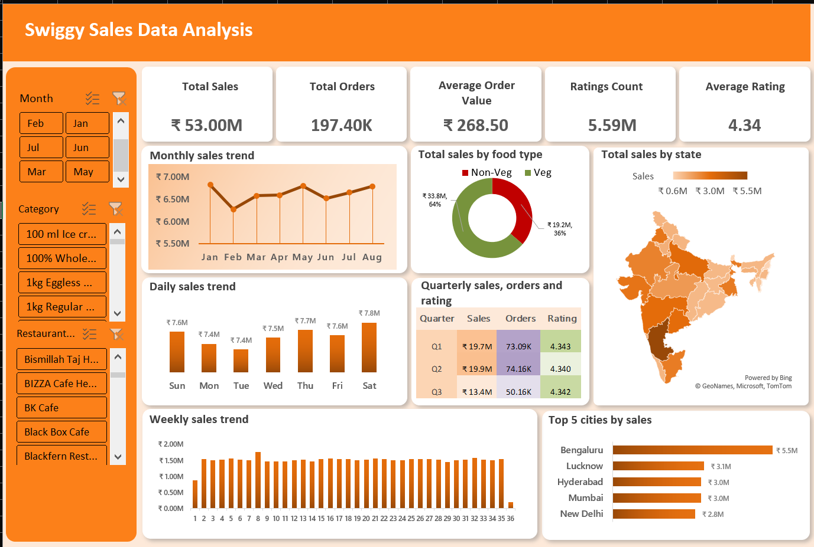

# Swiggy Sales Data Analysis Dashboard

This repository contains a **Swiggy Sales Data Analysis Dashboard** created in **Microsoft Excel**. The dashboard provides a comprehensive overview of Swiggy's sales performance across multiple dimensions including time, food type, location, and ratings.

---

## Screenshot

---

## Dashboard Overview

The dashboard is designed to help stakeholders quickly understand sales trends, identify top-performing products and locations, and make data-driven decisions.

### Key Metrics

- **Total Sales:** ₹53.00M
- **Total Orders:** 197.40K
- **Average Order Value:** ₹268.50
- **Ratings Count:** 5.59M
- **Average Rating:** 4.34

---

## Dashboard Components

1. **Filters**
   - **Month:** Select specific months to analyze sales trends.
   - **Category:** Filter sales based on product categories (e.g., Ice Cream, Eggless Cakes, etc.).
   - **Restaurant:** Filter sales for specific restaurants.

2. **Trends**
   - **Monthly Sales Trend:** Line chart showing sales variation month-wise.
   - **Weekly Sales Trend:** Bar chart displaying weekly sales patterns.
   - **Daily Sales Trend:** Bar chart showing day-wise sales performance.

3. **Sales Breakdown**
   - **Total Sales by Food Type:** Donut chart comparing sales between Veg and Non-Veg items.
   - **Total Sales by State:** Choropleth map of India highlighting states based on total sales.
   - **Top 5 Cities by Sales:** Horizontal bar chart showing cities with highest sales.

4. **Quarterly Analysis**
   - Table showing **Quarterly Sales, Orders, and Ratings** for Q1, Q2, and Q3.

---

## Features

- Interactive **filters** for month, category, and restaurant.
- Dynamic **charts and tables** for better visualization.
- Highlights **top-performing locations and products**.
- Provides insights into **sales trends** over different time periods.
- **Ratings analysis** for customer satisfaction.

---

## Tools Used

- Microsoft Excel
- Excel Charts (Line, Bar, Donut)
- Conditional Formatting
- Pivot Tables

---

## How to Use

1. Open the Excel file.
2. Use the **filters on the left panel** to select specific months, categories, or restaurants.
3. Observe changes in charts, tables, and metrics in real-time.
4. Analyze trends and performance insights for decision making.

---

## Future Enhancements

- Add **dynamic drill-down** for city and restaurant-level analysis.
- Include **monthly vs yearly comparison**.
- Incorporate **profit margin and cost analysis**.
- Automate **data refresh** from Swiggy sales CSV/Excel files.

---

## Author

**Sandhya Neupane**  
Data Analyst

